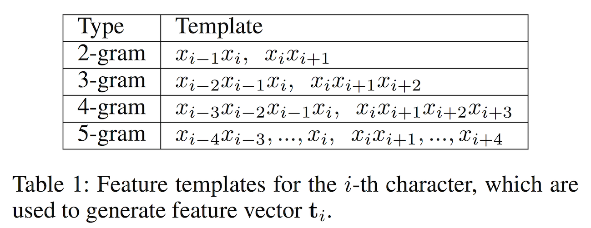
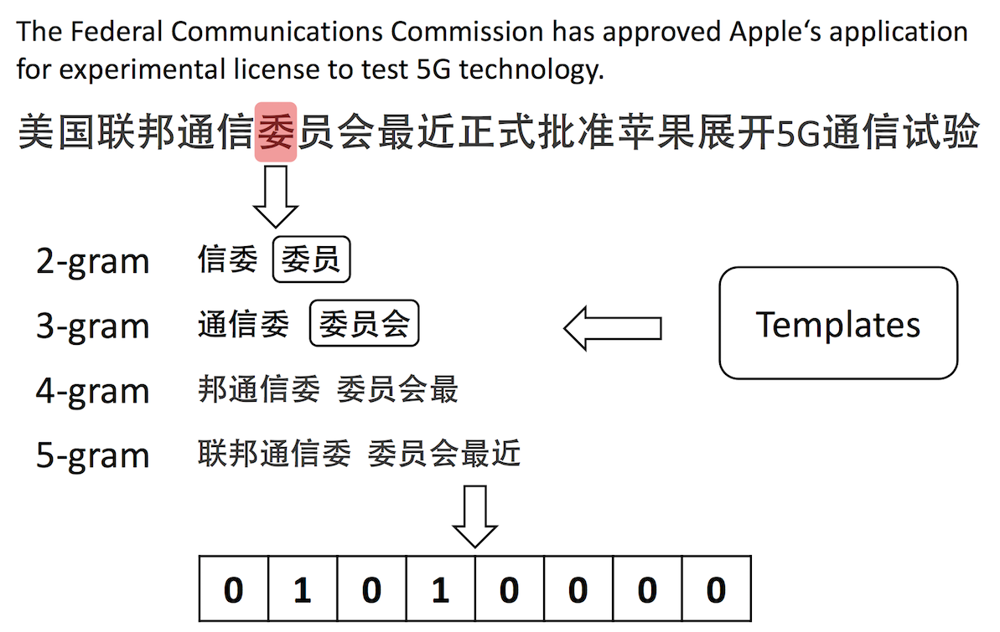
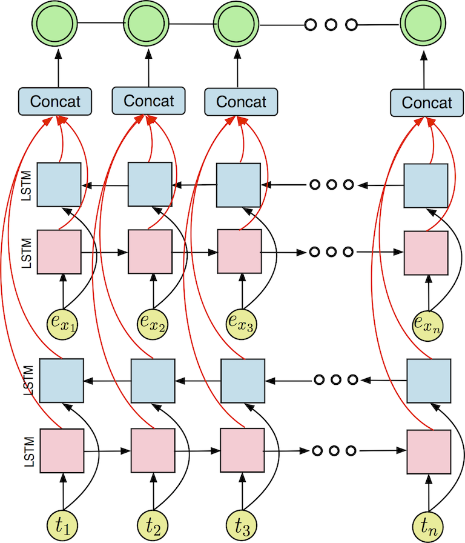
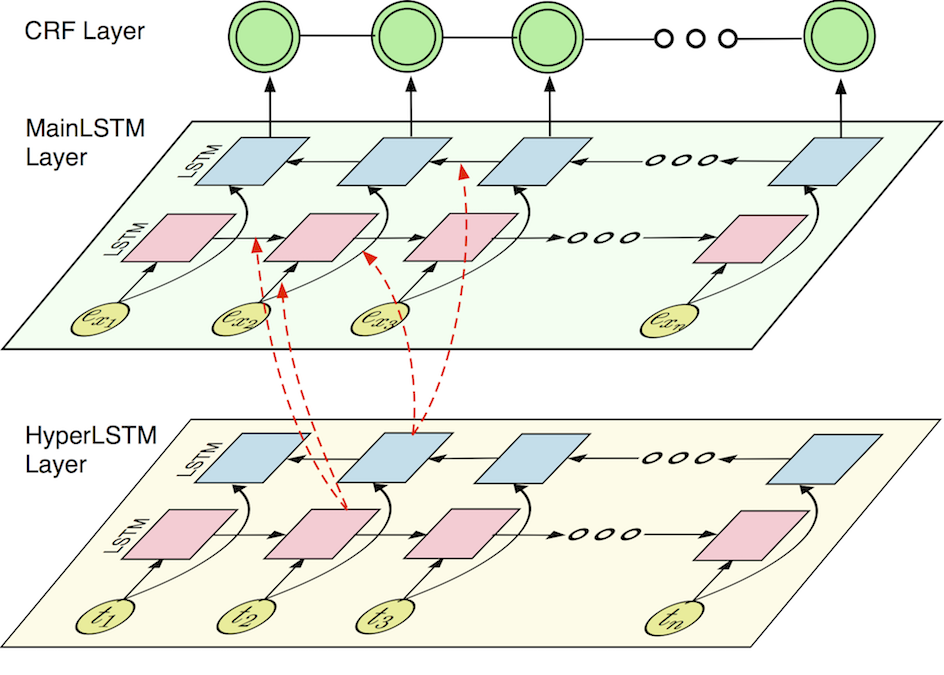

# Neural Networks Incorporating Dictionaries for Chinese Word Segmentation
Source codes and corpora for the Chinese word segmentation algorithm proposed in the following paper.

Qi Zhang, Xiaoyu Liu, Jinlan Fu. Neural Networks Incorporating Dictionaries for Chinese Word Segmentation. AAAI 2018 [PDF](http://jkx.fudan.edu.cn/~qzhang/paper/aaai2017-cws.pdf)

## Dependencies
* [Python 2.7](https://www.python.org/)
* [Tensorflow 1.0](https://www.tensorflow.org/)

## Directory structure

    CWS_dict
        same-domain:  In-domain evaluation for CWS (SIGHAN2005,CTB6)
        cross-domain: Cross-domain evaluation for CWS (SIGHAN2010)
        
## Introduction
Although neural network based methods achieved great success for Chinese word segmentation task, these methods typically lack the capability of processing rare words and data whose domains are different from training data. However, dictionaries contains both rare words and domain-specific words.
In this paper, we study the problem of integrating dictionaries into neural networks based methods for the Chinese word segmentation task. To integrate dictionaries, we define several feature templates to construct feature vectors for each character based on dictionaries and contexts. Then, two different methods that extend the Bi-LSTM-CRF are proposed to perform the task.

Experiments show our methods can achieve better performance than other state-of-the-art neural network methods and domain adaptation approaches in most cases. In particular, when applying the trained model on different domains, we only need to add extra domain specific dictionaries. The other learned parameters can remain unchanged with no need for retraining.

## Method
### 1 Feature Vector Construction
#### 1.1 The feature templates used in our work:

#### 1.2 An example of feature vector construnction:

### 2 Model-I

### 3 Model-II

